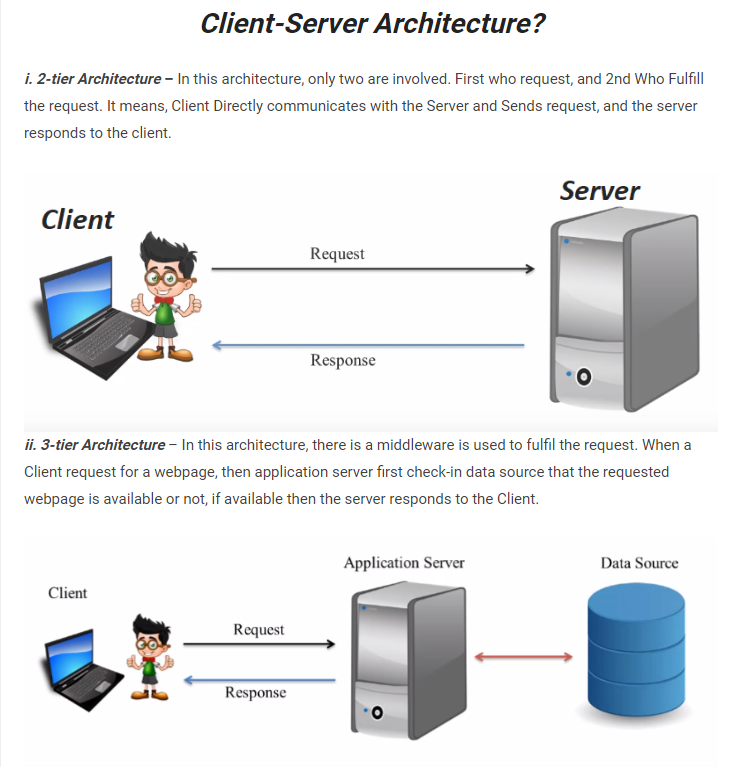

# PHP

## Client Server Environment



- PHP code is executed on the server, and the result is returned to the browser as plain HTML

## Comment

- `// This is a single-line comment`
- `# This is also a single-line comment`
- /* This is a multi-line comment */

- **PHP is a Loosely Typed Language**
- To get the data type of a variable or object use the `var_dump()` function.
- `gettype()` to get the data type of variable or object
- `settype()` Set the type of a variable
- A variable declared **outside** a function has a GLOBAL SCOPE and can only be accessed outside a function
- The `global` keyword is used to access a global variable from within a function.

```jsx
/*
	PHP also stores all global variables in an array called $GLOBALS[index]. 
	The index holds the name of the variable. 
	This array is also accessible from within functions and can be used to 
	update global variables directly.
*/

$x = 5;
$y = 10;

function myTest() {
  $GLOBALS['y'] = $GLOBALS['x'] + $GLOBALS['y'];
}

myTest();
echo $y; // outputs 15
```

- You can declare static variable inside function to make it preserve the data and not deleted after the function ends

```jsx
/*	
	If you want to change the data type of an existing variable, but not by changing 
	the value, you can use casting.
	Casting allows you to change data type on variables
*/

$x = 5;
$x = (string) $x;
var_dump($x);
```

- **Error Control Operator**
    - PHP supports one error control operator: the at sign (`@`). When prepended to an expression in PHP, any diagnostic error that might be generated by that expression will be suppressed.
        
        ```php
        // Variable
          $a = 10;
          $b = @$a or die("Variable Not Found");
        
          echo "Test $b";
          echo '<br>';
        
          // File
          $f = @file("osama.txt") or die("File Not Found");
          echo '<pre>';
          print_r($f);
          echo '</pre>';
          echo '<br>';
        
          // Include
          (@include("osama_elzero.php")) or die("Include File Not Found");
        ```
        

## String

- The PHP `strlen()` function returns the length of a string
- The PHP `str_word_count()` function counts the number of words in a string.
- The PHP `strpos()` function searches for a specific text within a string.
- The PHP `str_replace()` function replaces some characters with some other characters in a string.
- The PHP `explode()` function splits a string into an array.
- You can use **`implode()`** to concatenate array elements into a string
- To concatenate, or combine, two strings you can use the `.` operator
- You can return a range of characters by using the `substr()` function.

```jsx
// Three ways to print array:
var_dump($arr);
print_r($arr);
echo implode(" ", $arr);
```

## Heredoc Vs Nowdoc

- Heredoc
    - The **heredoc syntax** is a way to declare a string variable. The heredoc syntax takes at least three lines of your code and uses the special character `<<<` at the beginning.
    
    ```php
    /*
    	$nameOfVariable = <<< identifier 
    	// string
    identifier;
    */
    echo <<<"navlinks"
      <ul>
        <li>$name</li>
        <li>$name</li>
        <li>$name</li>
        <li>$name</li>
      </ul>
      navlinks;
    ```
    
- Nowdoc
    - Same as Heredoc but it doesn’t parse variables.
    - it’s declared with single quote

## Number


- Integer
    
    
    
- float
    
    
    
- The PHP `is_numeric()` function can be used to find whether a variable is numeric.
- Casting
    
    
    
    
    
- if you want a random integer between 10 and 100 (inclusive), use `rand(10, 100)`
- To create a constant, use the `define()` function.
    - You can also create a constant by using the `const` keyword
    - Constants are automatically global and can be used across the entire script.
    
    ```jsx
    define(name, value, case-insensitive);
    const MYCAR = "Volvo";
    ```
    
    
    
    - From PHP7, you can create an Array constant using the `define()` function.
- Comparison
    
    
    
    
    

## Associative array op


## Conditional Assignments


- The null coalescing operator returns the first operand if it exists and is not null; otherwise, it returns the second operand.
- $result = $variable ?? "default value";

## Foreach

- use of the `foreach` loop, is to loop through the items of an array.

```jsx
$colors = array("red", "green", "blue", "yellow");

foreach ($colors as $x) {
  echo "$x <br>";
}
```

- There are two types of arrays in PHP [indexed](https://www.w3schools.com/php/php_arrays_indexed.asp) array and [Associative](https://www.w3schools.com/php/php_arrays_associative.asp) arrays
- Indexed arrays: where the first item has the key 0, the second has the key 1, and so on
- Associative arrays: use named keys that you assign to them, and when looping through associative arrays, you might want to keep the key as well as the value.

```jsx
$members = array("Peter"=>"35", "Ben"=>"37", "Joe"=>"43");

foreach ($members as $x => $y) {
  echo "$x : $y <br>";
}
```

- The `foreach` loop can also be used to loop through properties of an object

```jsx
class Car {
  public $color;
  public $model;
  public function __construct($color, $model) {
    $this->color = $color;
    $this->model = $model;
  }
}

$myCar = new Car("red", "Volvo");

foreach ($myCar as $x => $y) {
  echo "$x: $y <br>";
}
```

- When looping through the array items, any changes done to the array item will, by default, NOT affect the original array

```jsx
// Imp Note

$colors = array("red", "green", "blue", "yellow");

foreach ($colors as $x) {
  if ($x == "blue") $x = "pink";
}

var_dump($colors);
```

- by using the `&` character in the `foreach` declaration, the array item is assigned *by reference*, which results in any changes done to the array item will also be done to the original array

```jsx
$colors = array("red", "green", "blue", "yellow");

foreach ($colors as &$x) {
  if ($x == "blue") $x = "pink";
}

var_dump($colors);
```

## Functions

- You can specify a default value for parameters
- By using the `...` operator in front of the function parameter, the function accepts an unknown number of arguments. This is also called a variadic function
- The variadic function argument becomes an array.

```jsx
function sumMyNumbers(...$x) {
  $n = 0;
  $len = count($x);
  for($i = 0; $i < $len; $i++) {
    $n += $x[$i];
  }
  return $n;
}

$a = sumMyNumbers(5, 2, 6, 2, 7, 7);
echo $a;
```

- Be carful ⇒ You can only have one argument with variable length, and it has to be the last argument.
- To declare a type for the function return, add a colon ( `:` ) and the type right before the opening curly ( `{` )bracket when declaring the function.

```php
function addNumbers(float $a, float $b) : float {
  return $a + $b;
}
echo addNumbers(1.2, 5.2);
```

- In PHP, arguments are usually passed by value
- When a function argument is passed by reference, changes to the argument also change the variable that was passed in. To turn a function argument into a reference, the `&` operator is used

```php
function add_five(&$value) {
  $value += 5;
}

$num = 2;
add_five($num);
echo $num;
```

- func_num_args(): to get number of arguments in the function
- func_get_args():  return associative array with index as key and args as value

## Anonymous Function

- Anonymous functions, also known as `closures`, allow the creation of functions which have no specified name. They are most useful as the value of [callable](https://www.php.net/manual/en/language.types.callable.php) parameters, but they have many other uses.

```php
// Anonymous Function In Variable

  $say_hello = function() {
    return "Hello";
  };

  echo $say_hello();

  echo '<br>#########<br>';

  // Anonymous Function With Parameter In Variable

  $say_hola = function($someone) {
    return "Hola $someone";
  };

  echo $say_hola("Osama");

  echo '<br>#########<br>';

  // Inherit Variable From Parent Scope

  $msg = "Hi";

  $say_hi = function($someone) use ($msg) {
    return "$msg $someone";
  };

  echo $say_hi("Osama");

  echo '<br>#########<br>';

  // Pass Anonymous Function To Function => array_map

  $nums = [10, 20, 30, 40, 50];

  function add_five($item) {
    return $item + 5;
  }

  $nums_after_adding_five = array_map("add_five", $nums);

  echo '<pre>';
  print_r($nums_after_adding_five);
  echo '</pre>';

  $nums_after_adding_ten = array_map(function($item) { return $item + 10; }, $nums);

  echo '<pre>';
  print_r($nums_after_adding_ten);
  echo '</pre>';
```

## Arrow Function

- Arrow functions support the same features as [anonymous functions](https://www.php.net/manual/en/functions.anonymous.php), except that using variables from the parent scope is always automatic.

```php
// Arrow Function In Variable

  $say_hello = fn() => "Hello";

  echo $say_hello();

  echo '<br>#########<br>';

  // Arrow Function With Parameter In Variable

  $say_hola = fn($someone) => "Hola $someone";

  echo $say_hola("Osama");

  echo '<br>#########<br>';

  // Arrow Inherit Variable From Parent Scope Is Automatic

  $msg = "Hi";

  $say_hi = fn($someone) => "$msg $someone";

  echo $say_hi("Osama");

  echo '<br>#########<br>';

  // Pass Arrow Function To Function => array_map

  $nums = [10, 20, 30, 40, 50];

  $nums_after_adding_ten = array_map(fn($item) => $item + 10, $nums);

  echo '<pre>';
  print_r($nums_after_adding_ten);
  echo '</pre>';

```

## Array


- You can create array using the `[]` brackets
- indexed arrays are the same as associative arrays, but associative arrays have names instead of numbers
- Array items can be of any data type, including function.
- To execute such a function, use the index number followed by parentheses `()`
- Use the key name when the function is an item in a associative array
- `count()` function for counting array items
- `array_push()` function to add a new item to the array
    
    ```php
    $fruits = array("Apple", "Banana", "Cherry");
    array_push($fruits, "Orange", "Kiwi", "Lemon");
    ```
    
- To remove an existing item from an array, you can use the `array_splice()` function
    
    ```php
    $cars = array("Volvo", "BMW", "Toyota");
    array_splice($cars, 1, 1);
    
    //You can also use the unset() function to delete existing array items
    unset($cars[1]);
    ```
    
- To remove items from an associative array, you can use the `unset()` function.
    
    ```php
    $cars = array("brand" => "Ford", "model" => "Mustang", "year" => 1964);
    unset($cars["model"]);
    ```
    
- You can also use the `array_diff()` function to remove items from an associative array.
    
    ```php
    //This function returns a new array, without the specified items
    $cars = array("brand" => "Ford", "model" => "Mustang", "year" => 1964);
    $newarray = array_diff($cars, ["Mustang", 1964]);
    ```
    
- The `array_pop()` function removes the last item of an array.
- The `array_shift()` function removes the first item of an array.
- arrays
    - are arrays that use named keys that you assign to them
    
    ```php
    // To access an array item you can refer to the key name.
    $car = array("brand"=>"Ford", "model"=>"Mustang", "year"=>1964);
    echo $car["model"];
    
    foreach ($car as $x => $y) {
      echo "$x: $y <br>";
    }
    ```
    
- Sort Array
    
    
    

## **Super Globals**

> Some predefined variables in PHP are "**superglobals**", which means that they are always accessible, regardless of scope - and you can access them from any function, class or file without having to do anything special.
> 
- **Global Variables**
    - `$GLOBALS` is an array that contains all global variables.
    - Variables of the outer most scope are automatically global variables, and can be used by any scope, e.g. inside a function.
    
    ```php
    /*
    	To use a global variable inside a function you have to either 
    	define them as global with the global keyword, or refer to them by using 
    	the $GLOBALS syntax.
    */
    
    $x = 75;
      
    function myfunction() {
      echo $GLOBALS['x'];
    }
    
    myfunction()
    ```
    
    - you can create global variables inside a function by using the `$GLOBALS` syntax
        
        ```php
        function myfunction() {
          $GLOBALS["x"] = 100;
        }
        
        myfunction();
        
        echo $GLOBALS["x"];
        echo $x;
        ```
        
- **$_SERVER**
    - `$_SERVER` is a PHP super global variable which holds information about headers, paths, and script locations.
    
- **$_REQUEST**
    - `$_REQUEST` is a PHP super global variable which contains submitted form data, and all cookie data.
    - is an array containing data from `[$_GET](https://www.w3schools.com/php/php_superglobals_get.asp)`, `[$_POST](https://www.w3schools.com/php/php_superglobals_post.asp)`, and `[$_COOKIE](https://www.w3schools.com/php/php_cookiest.asp)`.
    - You can access this data with the `$_REQUEST` keyword followed by the name of the form field, or cookie, like this: `$_REQUEST['firstname']`
    
    ```php
    <html>
    <body>
    
    <form method="post" action="demo_request.php">
      Name: <input type="text" name="fname">
      <input type="submit">
    </form>
    
    <?php
    if ($_SERVER["REQUEST_METHOD"] == "POST") {
      $name = htmlspecialchars($_REQUEST['fname']);
      if (empty($name)) {
        echo "Name is empty";
      } else {
        echo $name;
      }
    }
    ?>
    
    </body>
    </html>
    /*
    	When a user clicks the submit button, the form data is sent to a PHP file 
    	specified in the action attribute of the <form> tag.
    	In the action file we can use the $_REQUEST variable to collect the value 
    	of the input field.
    */
    ```
    
- **$_POST**
    - contains an array of variables received via the HTTP POST method
    - There are two main ways to send variables via the HTTP Post method:
        - HTML forms
        - JavaScript HTTP requests
    
    ```php
    <html>
    <body>
    
    <form method="POST" action="<?php echo $_SERVER['PHP_SELF'];?>">
      Name: <input type="text" name="fname">
      <input type="submit">
    </form>
    
    <?php
    if ($_SERVER["REQUEST_METHOD"] == "POST") {
      $name = htmlspecialchars($_POST['fname']);
      if (empty($name)) {
        echo "Name is empty";
      } else {
        echo $name;
      }
    }
    ?>
    
    </body>
    </html>
    ```
    
    - **$_POST in JavaScript HTTP Requests**
- **$_GET**
    - contains an array of variables received via the HTTP GET method.
    - There are two main ways to send variables via the HTTP GET method:
        - Query strings in the URL
        - HTML Forms
    - **Query string in the URL**
        - A query string is data added at the end of a URL. In the link below, everything after the `?` sign is part of the query string
        
        ```php
        <a href="demo_phpfile.php?subject=PHP&web=W3schools.com">Test $GET</a>
        ```
        
    
    ```php
    <html>
    <body>
    
    <?php
    echo "Study " . $_GET['subject'] . " at " . $_GET['web'];
    ?>
    
    </body>
    </html>
    ```
    

## Form

- isset($var): Returns **`true`** if **`var`** exists and has any value other than **`null`**. **`false`** otherwise.

## Include Vs Require

- in the case of failure, the ‘include’ and ‘require statements’ are different:
    - Include in PHP will only generate an alert (E_WARNING), and the script will proceed.
    - Require will produce a fatal error (E_COMPILE_ERROR) and interrupt the script.
- include_once || require_once
    - if the code from a file has already been included, it will not be included again